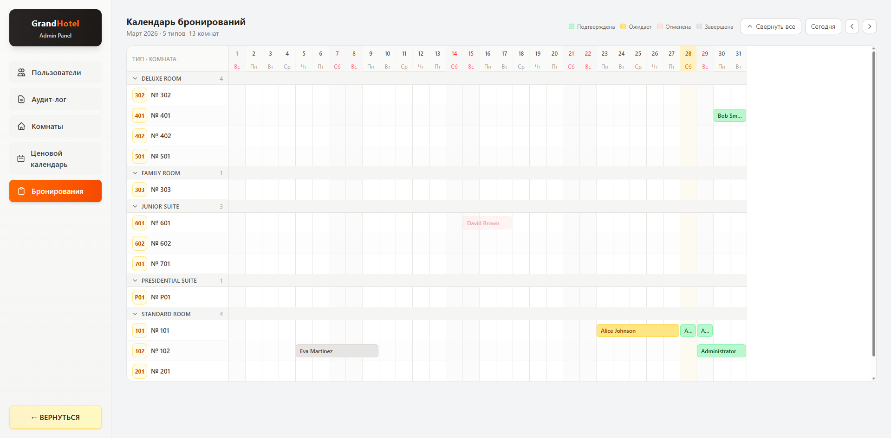
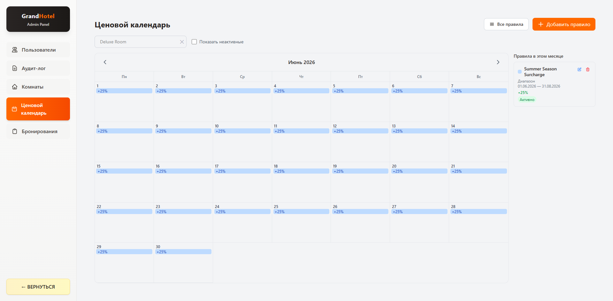
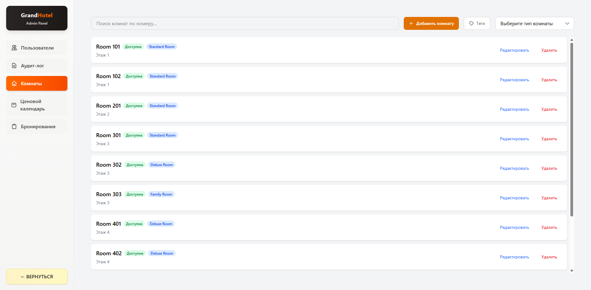

#  GrandHotel — Hotel Management System

> Full-featured hotel management web application with separate panels for guests, moderators, and administrators.

---


## Features

### Guest / User Panel
- Registration and authentication
- Browse and filter available rooms by type, tags
- Room details page with gallery
- Booking flow with payment page
- Personal profile and reservation history

### Admin / Moderator Panel
- **Reservations Calendar** — visual overview of all bookings
- **Price Calendar** — manage dynamic pricing rules per date
- **Room Management** — add, edit, delete rooms, assign tags and room types
- **User Management** — view all registered users
- **Audit Log** — full action history across the system
- **Tags & Room Types** — manage room categorization

---

## Tech Stack

| Category | Technology |
|---|---|
| Framework | React 19 |
| Language | TypeScript 5.9 |
| Build Tool | Vite 7 |
| Styling | Tailwind CSS 4 |
| State Management | Redux Toolkit + React Redux |
| Server State | TanStack React Query 5 |
| Routing | React Router DOM 7 |
| HTTP Client | Axios |
| Forms | React Hook Form |
| Notifications | React Hot Toast |
| Internationalization | i18next + react-i18next |

---

## Internationalization

The app supports **3 languages**:
- 🇦🇿 Azerbaijani (`az`)
- 🇬🇧 English (`en`)
- 🇷🇺 Russian (`ru`)

---

## Getting Started

### Prerequisites

- [Node.js](https://nodejs.org/) **v22+**
- **npm** (comes with Node.js)

Check your versions:
```bash
node -v   # should be v22.x.x
npm -v
```

### Installation

```bash
# 1. Clone the repository
git clone https://github.com/Elshan-Study/HotelManagementReact.git

# 2. Navigate into the project
cd HotelManagementReact

# 3. Install dependencies
npm install

# 4. Start the development server
npm run dev
```

The app will be available at **http://localhost:5173**

---

## Available Scripts

| Command | Description |
|---|---|
| `npm run dev` | Start local development server |
| `npm run build` | Type-check and build for production |
| `npm run preview` | Preview the production build locally |
| `npm run lint` | Run ESLint across the project |

---

## Project Structure

```
src/
├── api/                    # Axios instance and error handler
├── components/
│   ├── layout/             # Page layouts (user, admin)
│   └── ui/                 # Reusable UI components
├── features/               # Feature modules (auth, rooms, reservations, etc.)
│   ├── auth/
│   ├── auditLog/
│   ├── priceRule/
│   ├── reservation/
│   ├── room/
│   ├── roomType/
│   ├── tag/
│   └── user/
├── locales/                # Translation files (az, en, ru)
├── pages/                  # Page components
│   ├── Home.tsx
│   ├── Rooms.tsx
│   ├── Booking.tsx
│   ├── Login.tsx
│   └── admin/              # Admin-only pages
├── routes/                 # Protected route wrapper
├── store/                  # Redux store and auth slice
└── utils/                  # Utility functions
```

---
## Screenshots & Demo

### Home Page


### Room Selection


### Booking Flow


### Admin Panel — Reservations Calendar



### Admin Panel — Price Calendar



### Admin Panel — Room Management



---

## Backend

This is the **frontend** part of the GrandHotel system.
The backend repository can be found here: https://github.com/T12ys/HotelManagement.API.git

Make sure the backend server is running before starting the frontend.

---

## License

This project is private and not open for public contributions.